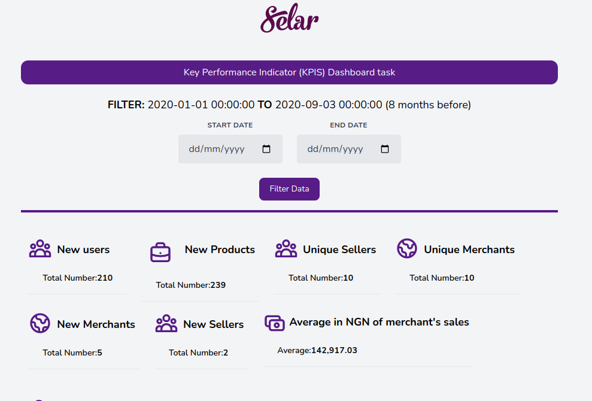

# selar-kpis-dashboard-task
A short test for selar
## Technology
Logic was built using Laravel, and styling was done using Tailwind CSS.
## Setup
- Link the database and configure the .env file of the project.
- Run `php artisan serve`, then visit `http://127.0.0.1/`
- KPIs can be filtered using the date filter above.
- The key performance indicator (KPI), the merchant's average sales, which is computed in naira and converted to naira using the free conversion APIs available at https://api.apilayer.com/
- ### Screenshot

